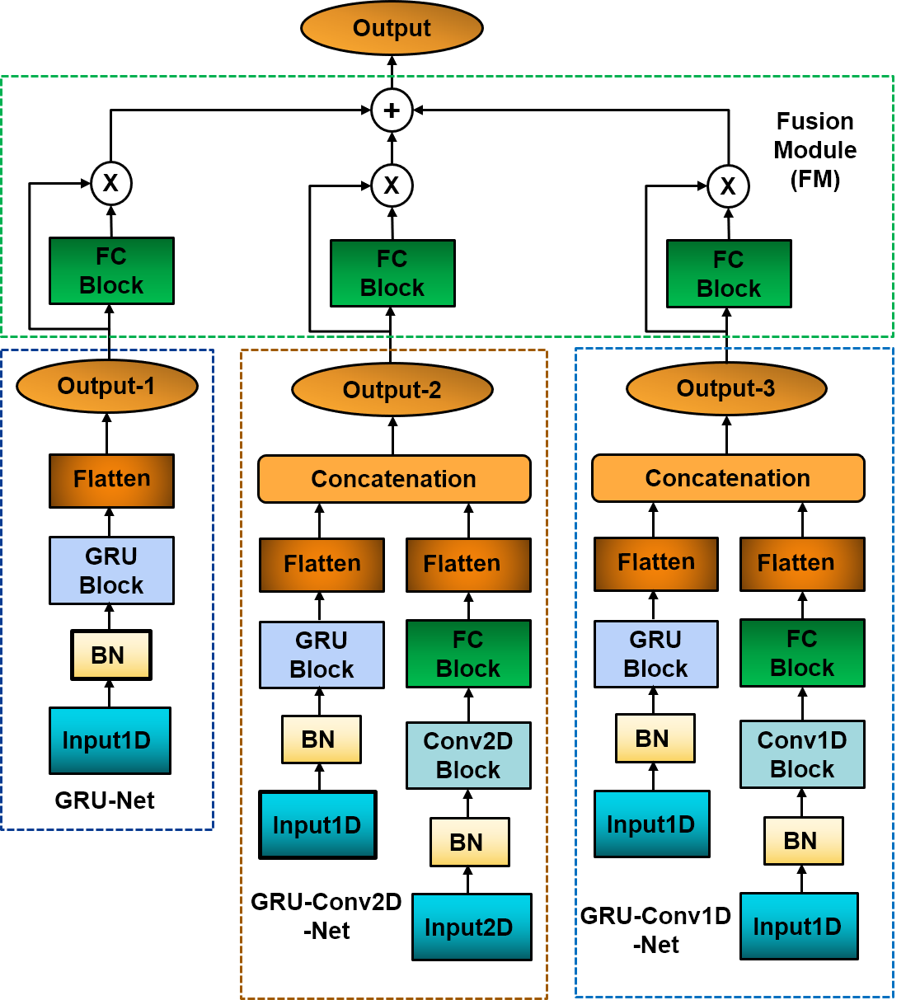

#  Estimation of Lower Extremity Joint Moments and 3D Ground Reaction Forces Using IMU Sensors in Multiple Walking Conditions: A Deep Learning Approach

This repository contains the code for **Kinetics-FM-DLR-Ensemble-Net**, a novel deep learning model designed to estimate human joint moments and ground reaction forces (GRFs) using data from three IMU sensors placed on the thigh, shank, and foot. Traditionally, measuring human kinetics has been limited to lab environments due to the reliance on motion capture systems and force plates, making it challenging to gather kinetic data in real-world walking scenarios. **Kinetics-FM-DLR-Ensemble-Net** overcomes these limitations by employing IMU sensors and machine learning techniques to estimate hip, knee, and ankle joint moments along with 3-dimensional GRFs across several representative walking conditions, including treadmill, level-ground, stair, and ramp walking.


<p align="center">
  
  <br>
  <em>Figure 1: Overview of the Kinetics-FM-DLR-Net architecture</em>
</p>

<p align="center">
  
  <br>
  <em>Figure 2: Overview of the Kinetics-FM-Net architecture</em>
</p>


### Key Features
- **Multimodal IMU Input**: Uses data from IMU sensors placed on the thigh, shank, and foot for robust predictions.
- **Versatility Across Walking Conditions**: Accurately estimates joint moments and GRFs in a variety of walking conditions found in daily life.
- **State-of-the-Art Performance**: Significantly outperforms existing deep learning models for kinetics estimation.

This is the first deep-learning model to predict both joint moments and GRFs in multiple walking conditions using IMU sensors, providing a practical solution for biomechanical analysis outside the laboratory.


## Datasets
- **Dataset A** can be accessed from the [Google Drive](https://drive.google.com/drive/folders/16UA4C2zR-4kOQIyLNUUEiWohwOfMg6N8?usp=sharing)
- **Dataset B** can be accessed from the [Google Drive](https://drive.google.com/file/d/1KeJ28eHjcqvFv5FeLutdStfs9GGYq-I_/view?usp=sharing)

## Citations

``` bibtex

@article{hossain2023estimation,
  title={Estimation of lower extremity joint moments and 3d ground reaction forces using imu sensors in multiple walking conditions: A deep learning approach},
  author={Hossain, Md Sanzid Bin and Guo, Zhishan and Choi, Hwan},
  journal={IEEE Journal of Biomedical and Health Informatics},
  volume={27},
  number={6},
  pages={2829--2840},
  year={2023},
  publisher={IEEE}
}
